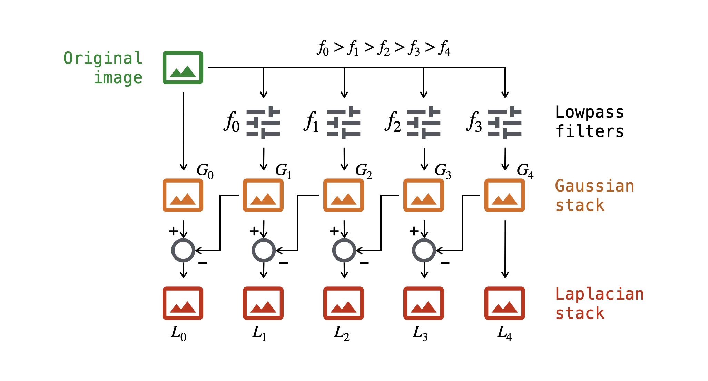
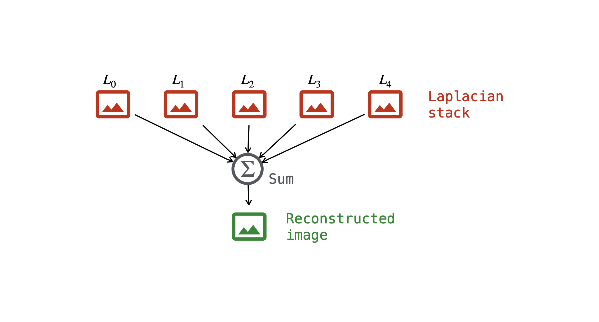
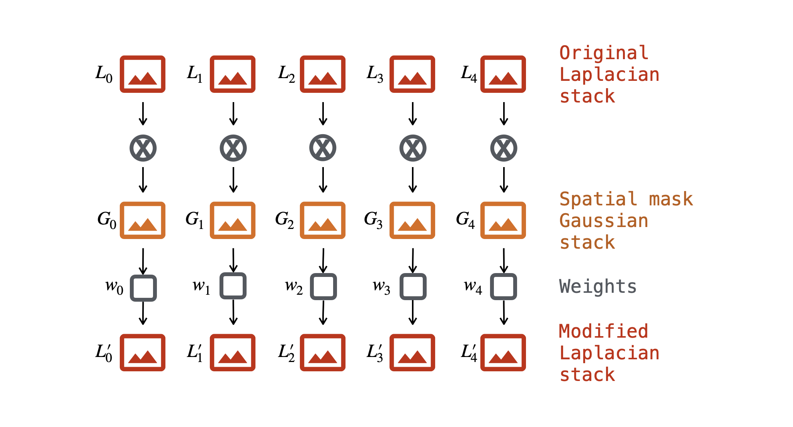
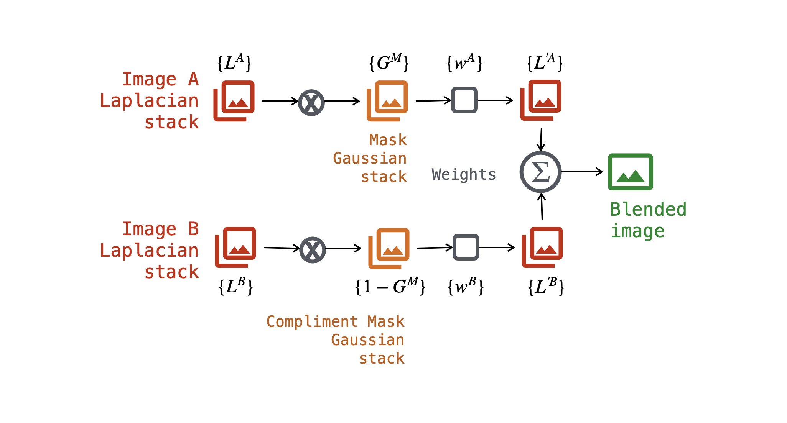

# img-blending
This repository has a Jupyter notebook for the Medium artical "An Introduction to Image Blending":

https://medium.com/tangibit-studios/an-introduction-to-image-blending-a5c0d83bdabe

## Theory

For simplicity, only grayscale images will be used. Processing color images is similar; the same operations are applied to each RGB channel.

The flow diagram below shows how Gaussian and Laplacian image stacks are generated from an image. The lowpass filters are implemented by 2D Gaussian functions. They are multiplied with the Fourier transform of the image to create a filtered spectrum. This spectrum is then transformed back into an image. The Laplacian stack images contain information in spatial frequency bands. Note that Laplacian stack images can have negative pixel values due to the subtraction operation that generates them.

The orginal image can be reconstructed by summing the Laplacian image stack.

A Laplacian stack can be modified by applying a spatial mask normalized to 1 which has been turned into a Gaussian image stack. Each Laplacian image in the stack can also be weight by an overall factor between 0 and 1.

Image blending uses a combination of modified Laplacian stacks from two images as shown below. For clarity, the stacks are represented as a set, as are the weights.

